# CC Switch MCP Server - 架构设计

## 整体架构

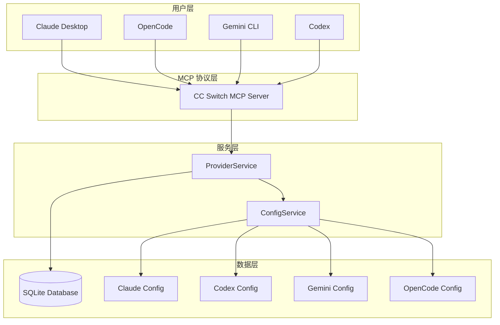

## 组件架构

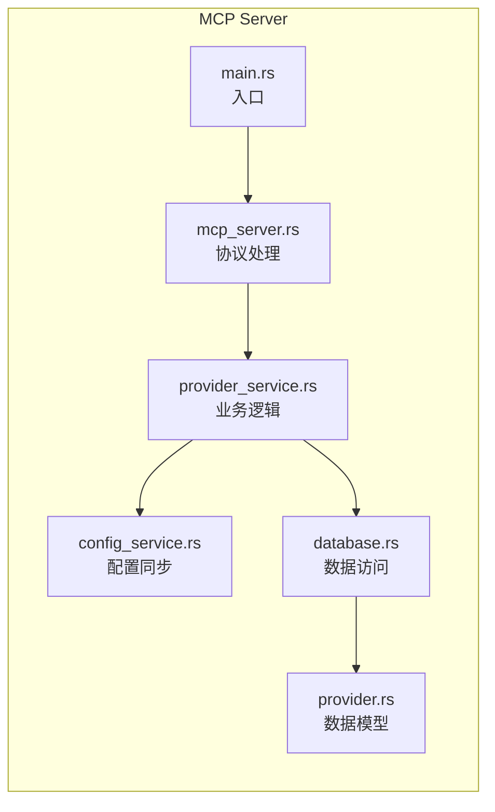

## 数据流

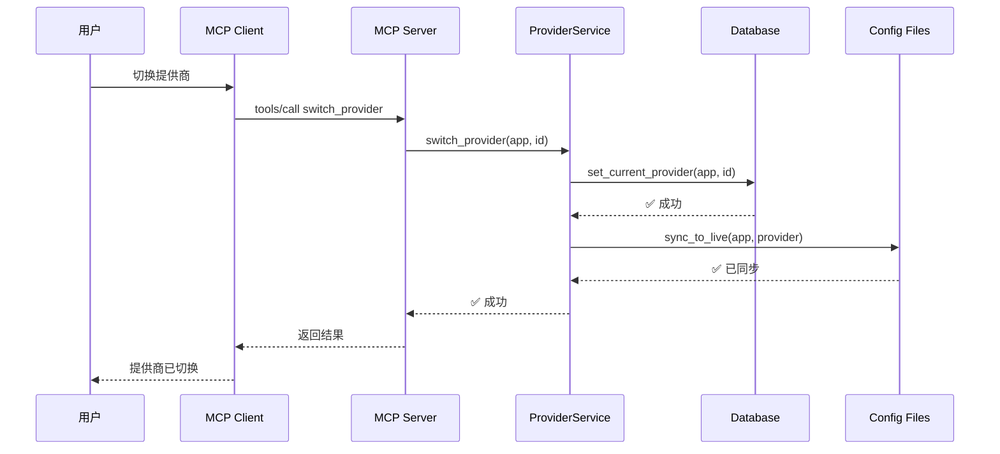

## 工具分类

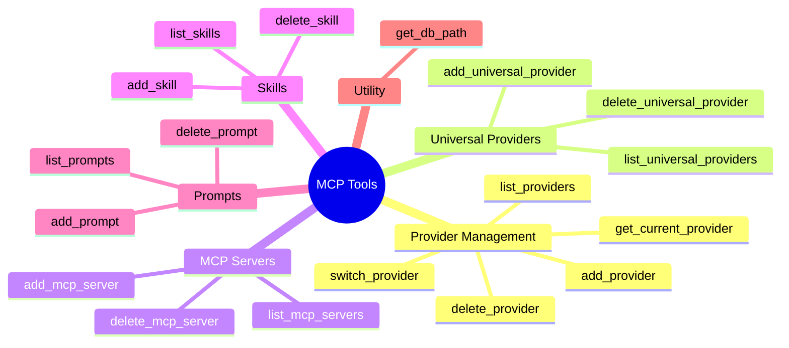

## 数据库 Schema

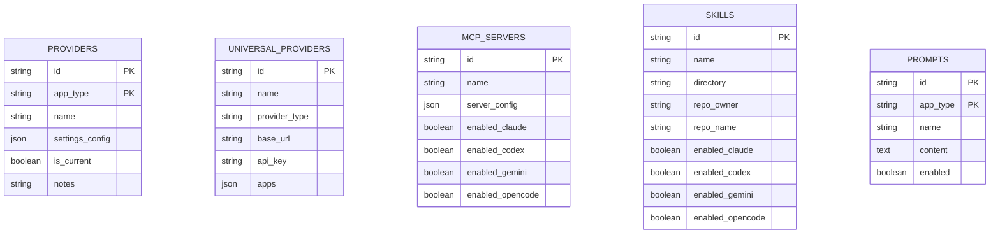

## 配置同步流程

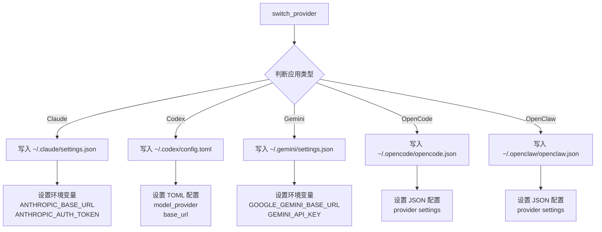

## NPM 包架构

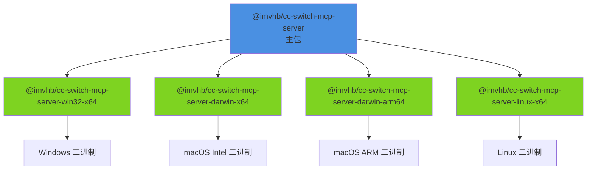

## 发布流程


## 技术栈

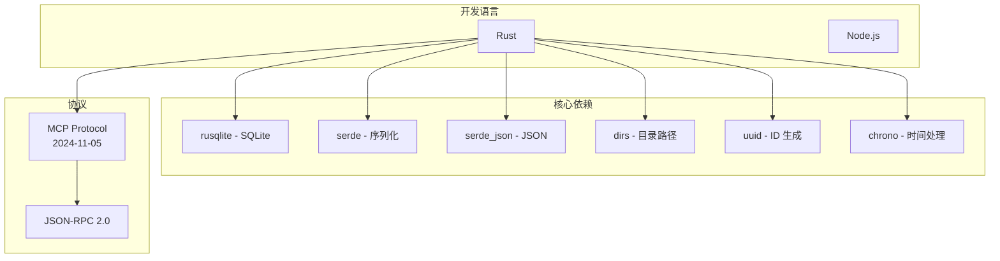

## 文件结构

```
cc-switch-mcp/
├── src/                      # Rust 源代码
│   ├── main.rs              # 程序入口
│   ├── lib.rs               # 库导出
│   ├── error.rs             # 错误处理
│   ├── provider.rs          # 数据模型
│   ├── database.rs          # 数据库层
│   ├── config_service.rs    # 配置同步服务
│   ├── provider_service.rs  # 业务逻辑层
│   └── mcp_server.rs        # MCP 协议实现
│
├── bin/                      # NPM 启动脚本
│   └── cc-switch-mcp.js     # 二进制启动器
│
├── scripts/                  # NPM 脚本
│   └── install.js           # 平台包安装脚本
│
├── .github/workflows/        # GitHub Actions
│   └── release.yml          # 自动发布流程
│
├── Cargo.toml               # Rust 配置
├── package.json             # NPM 配置
├── README.md                # 英文文档
├── README_CN.md             # 中文文档
└── ARCHITECTURE.md          # 架构文档
```

## 关键设计决策

### 1. 为什么选择 Rust？

- ✅ **性能优异** - 原生性能，启动快
- ✅ **内存安全** - 无 GC，零成本抽象
- ✅ **跨平台** - 一次编写，处处编译
- ✅ **类型安全** - 编译期类型检查

### 2. 为什么用 ConfigService？

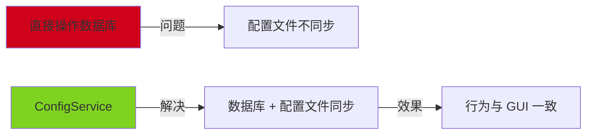

### 3. 为什么用多平台包？

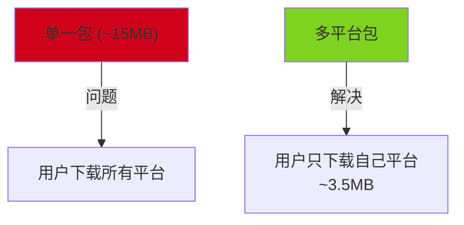

### 4. 数据一致性保证

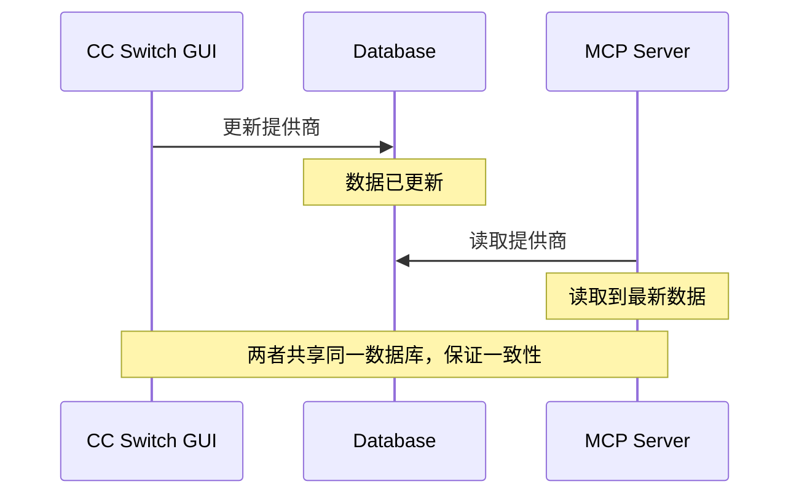

## 扩展性

### 支持新应用

只需在 `ConfigService` 中添加新的同步方法：

```rust
pub fn sync_provider_to_new_app(&self, provider: &Provider) -> Result<()> {
    // 1. 确定配置文件路径
    let config_path = Self::get_new_app_config_path()?;
    
    // 2. 写入配置
    // ...
    
    Ok(())
}
```

### 支持新工具

在 `mcp_server.rs` 中注册新工具：

```rust
fn handle_tools_list(&self) -> Result<Value> {
    Ok(json!({
        "tools": [
            // ... 现有工具
            {
                "name": "new_tool",
                "description": "新工具描述",
                "inputSchema": { /* ... */ }
            }
        ]
    }))
}
```

## 性能特性

- 🚀 **启动时间**: < 10ms
- 💾 **内存占用**: ~5MB
- 📦 **二进制大小**: ~3.5MB (压缩后)
- ⚡ **响应延迟**: < 1ms (本地调用)
- 💿 **数据库大小**: 共享 CC Switch 数据库

## 许可证

MIT License