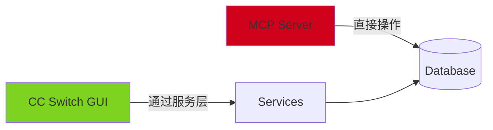
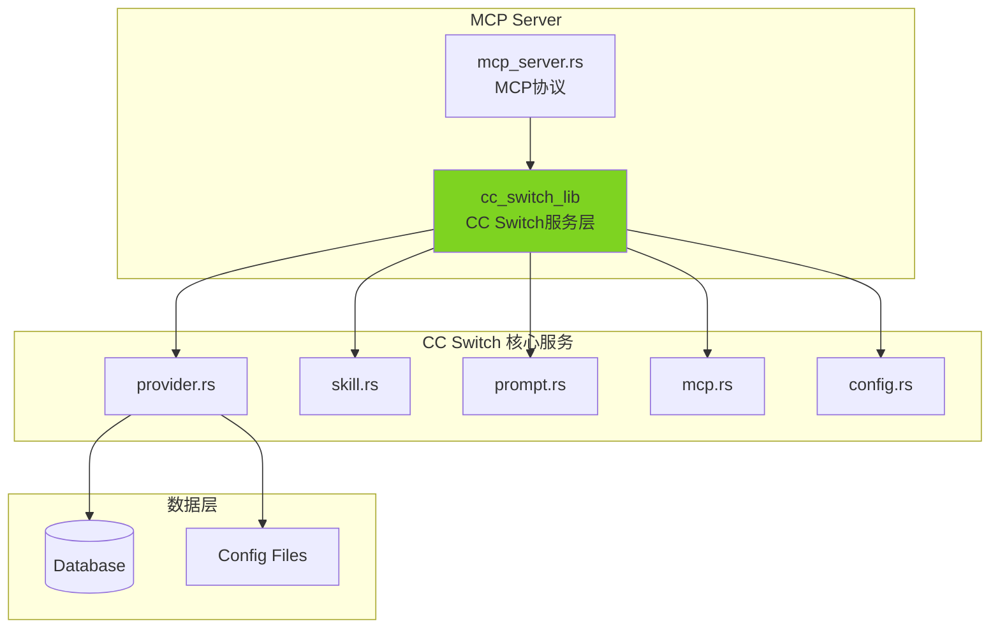

# CC Switch MCP Server - 重构计划

## 问题分析

当前架构存在严重问题：



**问题：**
- ❌ 绕过 CC Switch 业务逻辑
- ❌ 可能导致数据不一致
- ❌ 行为与 GUI 不同
- ❌ 需要重复实现功能

## 解决方案

### CC Switch 已有库支持！

```toml
# CC Switch Cargo.toml
[lib]
name = "cc_switch_lib"
crate-type = ["staticlib", "cdylib", "rlib"]
```

CC Switch 已经编译成可复用的库！

### 新架构设计



## 实施方案

### 方案 1: Git Submodule（推荐）

```bash
# 添加 CC Switch 作为 submodule
git submodule add https://github.com/farion1231/cc-switch.git cc-switch
```

```toml
# Cargo.toml
[dependencies]
cc_switch_lib = { path = "cc-switch/src-tauri" }
```

### 方案 2: Git Subtree

```bash
# 添加 CC Switch 作为 subtree
git subtree add --prefix=cc-switch https://github.com/farion1231/cc-switch.git main
```

### 方案 3: Crates.io（需要 CC Switch 发布）

```toml
# Cargo.toml
[dependencies]
cc-switch = "3.12"
```

## 代码重构

### 1. 删除重复代码

删除以下文件（CC Switch 已实现）：

```
src/
├── database.rs           ❌ 删除
├── config_service.rs     ❌ 删除
├── provider_service.rs   ❌ 删除
├── provider.rs           ❌ 删除
└── mcp_server.rs        ✅ 保留（MCP 协议层）
```

### 2. 使用 CC Switch API

```rust
// src/mcp_server.rs
use cc_switch_lib::{
    services::{
        provider::{ProviderService, Provider},
        skill::SkillService,
        prompt::PromptService,
        mcp::McpService,
    },
    database::Database,
};

pub struct McpServer {
    db: Database,
}

impl McpServer {
    pub fn new() -> Result<Self> {
        let db = Database::new()?;
        Ok(Self { db })
    }
    
    pub fn switch_provider(&self, app: &str, id: &str) -> Result<()> {
        // 直接调用 CC Switch 服务
        ProviderService::switch_provider(&self.db, app, id)?;
        Ok(())
    }
}
```

### 3. 新的项目结构

```
cc-switch-mcp/
├── cc-switch/                    # CC Switch submodule
│   └── src-tauri/
│       └── src/
│           ├── services/         # CC Switch 服务层
│           └── database/         # CC Switch 数据层
│
├── src/
│   ├── main.rs                   # 入口
│   ├── lib.rs                    # 导出
│   ├── error.rs                  # 错误处理
│   └── mcp_server.rs             # MCP 协议实现
│
├── Cargo.toml
└── README.md
```

## 优势对比

| 方面 | 当前架构 | 新架构 |
|------|---------|--------|
| 代码量 | ~3000 行 | ~500 行 |
| 行为一致性 | ⚠️ 可能不同 | ✅ 完全一致 |
| 维护成本 | 高（重复维护） | 低（复用） |
| 功能完整性 | ⚠️ 部分 | ✅ 完整 |
| Bug 修复 | 需要同步修复 | 自动同步 |

## 迁移步骤

### Phase 1: 准备工作（1 天）

- [ ] 创建新分支 `refactor/use-cc-switch-core`
- [ ] 添加 CC Switch 作为 submodule
- [ ] 配置 Cargo.toml 依赖

### Phase 2: 重构代码（2-3 天）

- [ ] 删除重复的服务层代码
- [ ] 引入 cc_switch_lib
- [ ] 重写 mcp_server.rs 调用 CC Switch API
- [ ] 处理依赖和类型转换

### Phase 3: 测试验证（1-2 天）

- [ ] 单元测试
- [ ] 集成测试
- [ ] 与 CC Switch GUI 行为对比测试
- [ ] 数据一致性验证

### Phase 4: 发布更新（0.5 天）

- [ ] 更新文档
- [ ] 更新版本号
- [ ] 发布新版本

## 风险与缓解

### 风险 1: CC Switch API 不稳定

**缓解：**
- 锁定 CC Switch 版本
- 定期同步更新

### 风险 2: 依赖冲突

**缓解：**
- 统一依赖版本
- 使用 workspace 管理

### 风险 3: 编译时间增加

**缓解：**
- 使用增量编译
- 缓存编译产物

## 成功标准

- ✅ 所有工具功能正常
- ✅ 与 CC Switch GUI 行为完全一致
- ✅ 代码量减少 > 80%
- ✅ 测试覆盖率 > 80%
- ✅ 性能无明显下降

## 时间线

```
Week 1: 准备 + 重构
Week 2: 测试 + 文档 + 发布
```

## 需要协调

### 给 CC Switch 的建议

1. **发布到 Crates.io**
   ```bash
   cargo publish
   ```
   这样其他项目可以直接 `cargo add cc-switch`

2. **提供公共 API 文档**
   - 导出的函数列表
   - 使用示例
   - 版本兼容性说明

3. **考虑 MCP Server 内置**
   - CC Switch 可以直接提供 `--mcp-server` 模式
   - 无需单独的 MCP Server 项目

## 下一步行动

1. ✅ 创建重构计划文档
2. ⏳ 添加 CC Switch submodule
3. ⏳ 验证 cc_switch_lib 可用性
4. ⏳ 开始代码重构

## 相关 Issue

建议在 CC Switch 创建 Issue：
- [ ] 请求发布到 Crates.io
- [ ] 请求公共 API 文档
- [ ] 讨论内置 MCP Server 支持